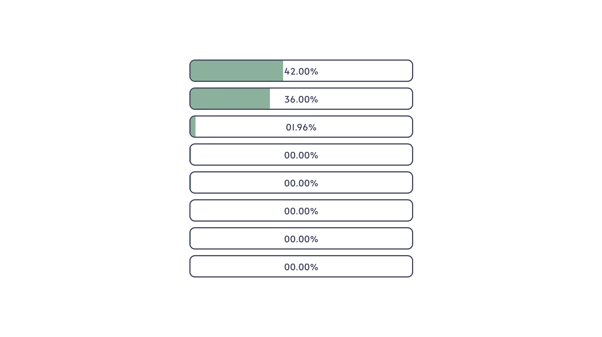

# Web HTOP

A web version of htop. The binary is self-sufficient, just run it and open [localhost:3133](http://localhost:3133). The statistic refreshes automatically every 500ms. You can open as many tabs as you want.

The app looks like this in light mode:

## Compiling 

If you want to compile the code yourself:
1. install cargo, node and yarn
2. clone the repo
3. run `yarn` and then `yarn build` inside the ui folder
4. run `cargo build --release` in the root of the project
5. your build will be in the `target/release` folder